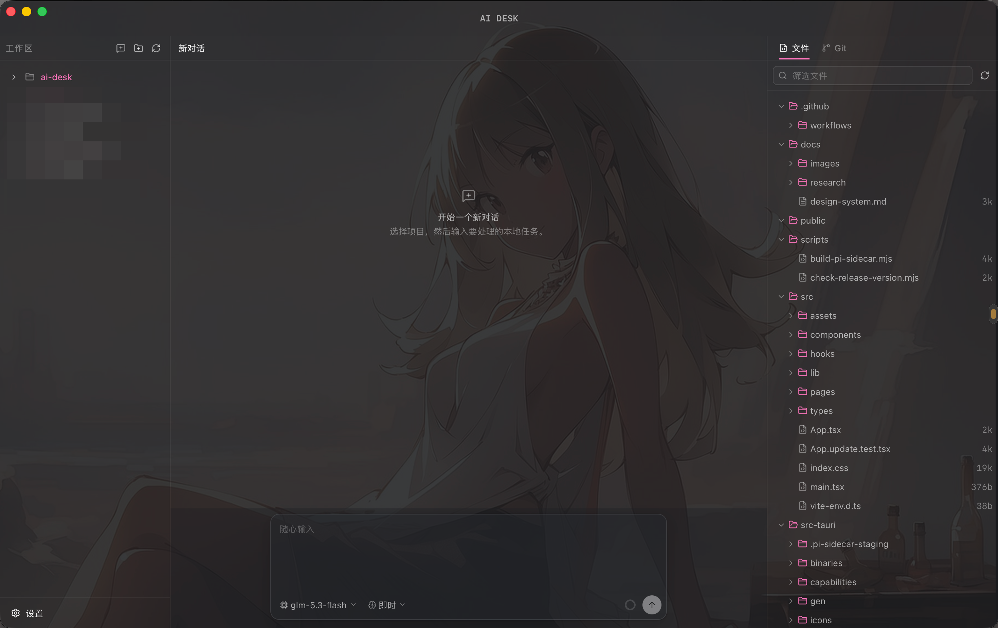

# ai-desk

本地优先的 Pi Coding Agent 桌面工作区。

## 预览




## 开发

要求：

- Node.js 22.19 或更高版本
- pnpm 11
- Bun 1.3 或更高版本（用于编译固定版本 Pi sidecar）
- Rust stable 与 Tauri 系统依赖

```bash
pnpm install
pnpm dev
```

`pnpm dev` 直接启动 Tauri 原生窗口。仅需要检查前端渲染时才使用
`pnpm web:dev`，它不会替代桌面调试入口。

`pnpm dev` 和 `pnpm desktop:build` 会先把锁定的
`@earendil-works/pi-coding-agent@0.84.2` 编译成当前平台的 Tauri sidecar。
应用运行时只使用该 sidecar；`AI_DESK_PI_PATH` 与
`AI_DESK_PI_PACKAGE_DIR` 仅用于明确的本地调试覆盖。

## 验证

```bash
pnpm test
pnpm lint
pnpm build
cargo test --manifest-path src-tauri/Cargo.toml
cargo clippy --manifest-path src-tauri/Cargo.toml --all-targets -- -D warnings
pnpm desktop:build
```

## GitHub 打包发布

仓库内置 `.github/workflows/release.yml`，会在 GitHub Actions 中并行构建：

- macOS Apple Silicon（DMG）
- macOS Intel（DMG）
- Windows x64（安装程序）
- Linux x64（DEB、RPM）

发布前需要同步修改以下三个版本号，并确保完全一致：

- `package.json`
- `src-tauri/tauri.conf.json`
- `src-tauri/Cargo.toml`

本地可先执行版本检查：

```bash
pnpm release:check
```

提交并推送代码后，创建与版本一致的标签即可触发打包：

```bash
git tag v0.1.0
git push origin v0.1.0
```

构建完成后，安装包会写入对应的工作流 Artifacts，并汇总到一个草稿
GitHub Release；确认四个平台产物完整后再发布该 Release。构建失败时，
直接在同一次 Actions 运行中重新执行失败任务，避免从其他提交覆盖该版本。

当前流程不包含 Apple Developer ID 或 Windows Authenticode 正式签名。
macOS 使用临时签名，Windows 安装时可能显示未认证发布者提示。

## 应用内更新

桌面应用内置 Tauri updater，支持从已发布的 GitHub Release 检查并
下载新版本；下载完成后，由用户确认安装并重启应用。

发布流程需要两个前置条件：

1. 本地生成更新签名密钥：

   ```bash
   pnpm tauri signer generate -w ~/.tauri/ai-desk.key -p ""
   ```

   公钥已写入 `src-tauri/tauri.conf.json` 的 `plugins.updater.pubkey`。

2. 在 GitHub 仓库 Secrets 中新增：

   - `TAURI_SIGNING_PRIVATE_KEY`：值为 `~/.tauri/ai-desk.key` 的文件内容

本地验证完整构建时，同样需要先导出该私钥：

```bash
export TAURI_SIGNING_PRIVATE_KEY="$(cat ~/.tauri/ai-desk.key)"
pnpm desktop:build
```

> 私钥一旦丢失就无法再对旧安装包签发更新，请妥善备份。

## 能力

- 左侧项目与 Pi JSONL 会话树
- 中间 Thinking、Tool Call、对话文件变更横幅
- 右侧本地文件预览、Git 状态和差异预览
- 项目级 Pi resources / extensions / settings 信任开关
- Pi RPC Extension UI 的 confirm、select、input、editor 与通知投影
- 基于 Git tree snapshot 的会话级变更统计
